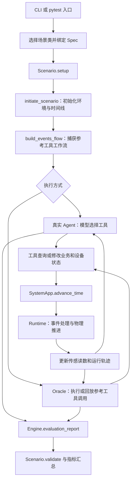

# Building L3 Scenario 执行逻辑与调用关系

更新日期：2026-09-08。

本文依据当前代码梳理一个 Building L3 Scenario 从选择、初始化、工具执行、时间推进到最终验证的过程。运行命令见 [scenario_test_guide.md](scenario_test_guide.md)。本文不代表新增测试结果。

## 1. 总体逻辑

一次运行首先建立包含初态、日程和未来事件的建筑环境，再由真实 Agent 或 Oracle 参考路径调用工具。工具改变业务与设备状态，时间推进让物理效果累积，最终根据实际轨迹验收。



图中的 Agent 和 Oracle 是不同运行分支，不会在一次正常执行中交替接管。

## 2. 关键文件与职责

| 文件 | 职责 |
|---|---|
| [fairy/cli.py](../../cli.py) | 真实模型或 Oracle 的命令行入口、报告输出 |
| [controllers/engine.py](../../controllers/engine.py) | 组织场景运行、注册 App、回放和评估 |
| [scenarios/scenario.py](../scenario.py) | 通用 `Scenario.setup()` 生命周期 |
| [l3/scenarios.py](l3/scenarios.py) | 注册 20 个场景类，绑定对应 Spec |
| [l3/specs.py](l3/specs.py) | 场景配置类型及约束 |
| [l3/catalog.py](l3/catalog.py) | 各场景的具体配置 |
| [base.py](base.py) | 三房间环境及工具初始化、时间推进 Hook |
| [l3/base.py](l3/base.py) | L3 初始化、参考工作流、控制策略与验收 |
| [SystemApp](../../apps/system.py) | Agent 时间推进接口与推进前检查 |
| [BuildingWorldRuntime](../../apps/building_world/runtime.py) | 事件队列、物理时间步、传感更新与轨迹 |
| [L3 测试](../../../tests/test_building_l3_scenarios.py) | 参考路径回放与场景契约测试 |

## 3. 选择和实例化 Scenario

`l3/scenarios.py` 中的场景类继承 `SpecDrivenBuildingL3Scenario`。装饰器 `_registered(number)` 取出 `L3_SPECS[number - 1]`，绑定到类并注册场景 ID。

因此，场景类是薄封装，主要差异来自 Spec：

- 起止时间、初始温湿度和室外天气曲线；
- 各阶段的房间人数、会议安排和设备需求；
- 运行中出现的用户交互；
- 打印任务及截止时间；
- 功率、空气质量和能耗等评估约束。

实例化时，`SpecDrivenBuildingL3Scenario.__post_init__()` 校验 Spec，设置 `start_time`、`duration`，并通过 `_build_briefing()` 生成任务描述。

## 4. 初始化环境：Scenario.setup()

通用 `Scenario.setup()` 在尚未初始化时依次调用：

```text
initiate_scenario()
→ build_events_flow()
```

### 4.1 父类建立建筑环境

`KechuangBuildingScenario.initiate_scenario()`：

1. 加载 `k1324.yaml`、`k1316.yaml`、`k1315.yaml`。
2. 创建 `BuildingWorldApp` 和 `BuildingWorldRuntime`，连接物理引擎与传感系统。
3. 调用 `configure_initial_runtime()` 安装场景初态。
4. 发布初始传感观测，保证第一次查询有读数。
5. 创建房间、预约、人员、设备、空调、通风、照明、会议设备、打印和传感器等 App。
6. 将 `SystemApp` 的时间推进 Hook 连接到 `_advance_runtime_for_agent()`。

各工具共享同一个 World 或 Runtime。空调工具修改的设备状态，能够被后续物理计算读取；传感工具读取该 Runtime 更新后的观测。

### 4.2 L3 子类安装具体时间线

`SpecDrivenBuildingL3Scenario.initiate_scenario()` 在父类初始化之后：

- 创建 `BuildingOperationsApp`，配置运行结束时刻、环境目标和功率限制；
- 注册 `time_advance_precondition`，在真实 Agent 快进前检查运行条件；
- 根据 Spec 安排人员阶段、会议生命周期、用户交互和打印请求；
- 区分初始公开请求与到指定时刻才出现的请求。

外部变化和 Agent 响应是两件事：人员进入、用户提出新要求属于场景安排；提高通风、修改预约、提交打印属于 Agent 动作。Agent 未及时响应时，外部变化仍会发生并影响环境。

## 5. 构建参考工作流：build_events_flow()

该方法在 `EventRegisterer.capture_mode()` 中捕获工具调用，并用事件 ID、依赖和延迟描述参考路径。

典型结构：

```text
发送任务
→ 查询建筑概况、初始传感器、运行边界和任务承诺
→ 推进到阶段检查点
→ 观测与协调当前计划
→ 控制环境、准备会议或处理打印
→ 等待物理响应
→ 再次验证
→ 后续检查点
→ 日终释放资源与清理
```

此时是在构建参考调用图。真实 Agent 不会被 Engine 强制沿着该图逐节点执行。Engine 提取任务描述后，模型自行选择工具；参考图用于 Oracle 执行、回放、可解性测试和人工审查。

参考工作流与 Runtime 时间线也不是同一份队列：前者描述参考行动，后者安排人员变化、用户交互及定时任务等世界变化。

## 6. 真实模型执行路径

`fairy/cli.py` 的真实模型分支调用 `Engine.run_scenario_agent()`。该方法可负责场景 setup 与 App 注册，然后应用场景补充 Prompt、解析任务描述并调用：

```python
self.agent.run(
    input=agent_task,
    max_tool_calls=max_tool_calls,
    timeout_seconds=timeout_seconds,
)
```

运行循环为：

```text
模型读取任务和历史
→ 选择工具及参数
→ 工具执行
→ 结果写入历史
→ 模型决定下一步
```

| 工具类型 | 示例 | 作用 |
|---|---|---|
| 查询 | 传感读数、房间状态、打印请求 | 返回当前可见信息 |
| 操作 | 调节通风、提交打印、修改预约 | 修改状态或安排后续工作 |
| 时间推进 | `SystemApp.advance_time()` | 累积设备效果并处理到期事件 |

提高通风强度不会让 CO₂ 瞬间达标。设备状态改变后，需要推进时间，再读取传感器才能检查控制效果。

## 7. 时间推进与物理计算

调用关系为：

```text
SystemApp.advance_time()
→ OperationsApp.time_advance_precondition()
→ 已注册的时间推进 Hook
→ KechuangBuildingScenario._advance_runtime_for_agent()
→ BuildingWorldRuntime.advance_to()
```

真实 Agent 默认开启 `stop_on_event`。推进前条件不满足时，工具返回拒绝原因；允许推进后，Runtime 在内部循环：

1. 消费当前时刻到期的事件。
2. 判断新事件是否要求 Agent 重新协调。
3. 依据最大时间步、目标时间和下一事件时间选择计算区间。
4. 将当前设备状态换算为热量、通风量等物理作用。
5. 结合室外天气与人员负荷推进物理状态。
6. 更新传感观测、轨迹和相关事件。

例如，模型请求推进一小时，但十分钟后出现需要重新规划的事件，Runtime 可以提前返回实际结束时刻和 `interruption` 信息。模型随后重新决策。

这是时间推进工具中的事件边界响应，不是模型生成过程中随时被异步打断。真实模型推理耗时与仿真时间推进也不能直接等同。

## 8. 当前 pytest 的 Oracle 回放路径

`tests/test_building_l3_scenarios.py` 的 `_replay()` 核心逻辑：

```python
build_engine = Engine(None, scenario_class())
oracle = build_engine.build_oracle_workflow(run_oracle=False)

replay_engine = Engine(None, scenario_class())
replayed = replay_engine.replay_workflow(oracle)

report = replay_engine.evaluation_report(replayed)
```

第一份环境构建参考工作流，不执行其中动作；第二份全新环境回放工具调用并进行验收。`Engine(None, ...)` 表示没有模型 Agent，不会访问远端 Qwen。

参数化测试覆盖 20 个场景，除了最终成功，还检查实际物理步、阶段覆盖、房间清空、设备关闭、预约释放、打印期限及环境等条件。

| 比较项 | Oracle 回放 | 真实模型 |
|---|---|---|
| 行动来源 | 已构建的参考工具调用 | 模型根据观测选择 |
| 是否调用 LLM | 否 | 是 |
| 时间推进 | 保留确定性回放行为 | 默认开启事件边界响应及推进前检查 |
| 主要验证目标 | 参考路径与代码能否正确执行 | 模型和 Controller 能否完成任务 |

当前代码为 Oracle/回放保留 `stop_on_event=False` 路径。因此 Oracle 通过提供可解性证据，但不覆盖真实 Agent 的所有运行条件，也不能替代真实模型测试。

## 9. 最终验收

```text
Engine.evaluation_report()
├─ Engine.evaluate()
│  └─ Scenario.validate()
└─ outcome_summary()
   └─ build_building_metrics()
```

L3 验证器读取实际状态和过程记录，检查运行覆盖、会议准备、打印截止时间、交互处理、环境、功率、无人能耗，以及最终设备关闭和资源释放。

必须区分：

- 模型宣称任务完成；
- 运行进程正常结束；
- 场景实际通过验证。

前两者不能替代最后一项。CLI 和批量运行报告中的 Validation 才反映当前验证器的验收结果，其含义仍取决于该场景配置的阈值。

## 10. 修改与排查入口

| 需要调整的问题 | 优先查看 |
|---|---|
| 某场景人数、天气、会议或验收阈值 | `l3/catalog.py` |
| 新增场景配置字段 | `l3/specs.py` |
| 所有 L3 的参考行动与验证 | `l3/base.py` |
| 房间和工具初始化 | `building_kechuang/base.py` |
| 长时间等待跨越事件、事件执行时间错误 | `runtime.py` 与 `SystemApp` Hook |
| 工具拒绝推进 | `operations_app.py` 的推进前检查 |
| 设备开了但环境不变化 | 设备状态、时间推进、设备物理映射与引擎 |
| Oracle 通过而模型失败 | 对照真实工具轨迹、Controller 历史和失败条件 |
| 模型说完成但 Validation 失败 | `validate()` 输出的失败条件和 Runtime 轨迹 |

建议阅读顺序：`tests/test_building_l3_scenarios.py` 的 `_replay()` → `Scenario.setup()` → 两层 `initiate_scenario()` → `build_events_flow()` → `SystemApp.advance_time()` → `Runtime.advance_to()` → `validate()`。
